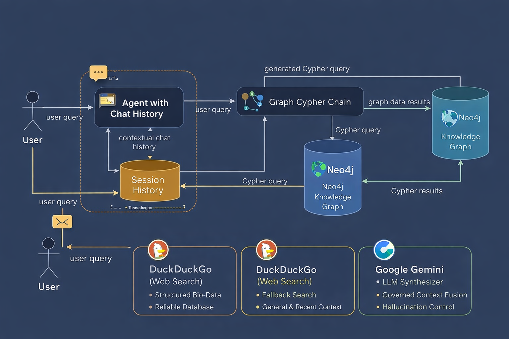

# 🧬 GraphRAG Medical Chatbot  
### Graph-Based Retrieval-Augmented Generation with Neo4j, LangChain & Google Gemini



---

## 📖 Overview

**GraphRAG Medical Chatbot** is a Retrieval-Augmented Generation (RAG) system designed to answer complex biological questions related to the **BSG gene**, associated diseases, proteins, and molecular interactions.

Unlike traditional RAG pipelines that rely exclusively on vector similarity search, this project leverages a **Knowledge Graph (Neo4j)** to retrieve structured biomedical relationships through dynamically generated **Cypher queries**.

The system combines:

- 🧠 Large Language Models (Google Gemini)
- 🗄 Graph database reasoning (Neo4j)
- 🔎 Optional hybrid fallback search
- 💬 Conversational memory via LangChain
- 🌐 Interactive UI built with Streamlit

This architecture enables precise, explainable, and relationship-aware answers to biomedical queries.

---

## 🚀 Key Features

### 🔗 Graph-Based Retrieval
- Converts natural language questions into **Cypher queries**
- Retrieves structured biomedical data from Neo4j
- Grounds responses in graph data to reduce hallucinations

### 🧠 LLM-Powered Answer Generation
- Uses **Google Gemini (2.x Flash / Pro models)** via `langchain-google-genai`
- Synthesizes structured graph results into human-readable explanations
- Deterministic Cypher generation (temperature = 0)

### 💬 Conversational Memory
- Maintains chat history across interactions
- Supports contextual follow-up questions

### 🌐 Interactive Interface
- Built with **Streamlit**
- Clean chat-based UI
- Sidebar with example biomedical queries

---

## 🛠️ Tech Stack

| Component | Technology |
|------------|------------|
| Language | Python 3.10+ |
| LLM | Google Gemini (via `langchain-google-genai`) |
| Graph DB | Neo4j |
| Orchestration | LangChain Core + Community |
| Frontend | Streamlit |
| Environment | python-dotenv |

---

## ⚙️ Installation & Setup

### 1 Clone the Repository

```bash
git clone https://github.com/YOUR_USERNAME/YOUR_REPO_NAME.git
cd YOUR_REPO_NAME
```
### 2 Create a Virtual Environment
```bash

python3 -m venv venv
source venv/bin/activate   # Windows: venv\Scripts\activate

```

### 3 Install Dependencies
```bash

pip install -r requirements.txt


```

### 4 Configure Environment Variables
Create a .env file in the project root:
# Google Gemini API Key
GOOGLE_API_KEY=your_google_api_key_here

# Neo4j Database Credentials
NEO4J_URI=bolt://localhost:7687
NEO4J_USER=neo4j
NEO4J_PASSWORD=your_password_here

# Model configuration
GRAPHRAG_QA_MODEL=models/gemini-2.5-flash
GRAPHRAG_CYPHER_MODEL=models/gemini-2.5-flash


### 5 (Optional) Populate the Database
```bash

python src/setup_db.py

```

### ▶️ Running the Application
```bash
Option A — Quick Start (Mac/Linux)
./start_demo.sh
Option B — Manual Start
streamlit run src/main_3.py
```